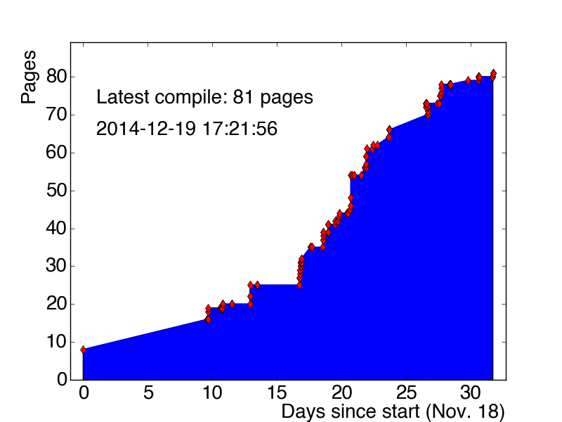

thesis
======

This is my thesis. Shoutout to Ryan for the template.

| milestones                                          | date                                        |
| --------------------------------------------------- | ------------------------------------------- |
| [01-Sep-2010](fuck.png)                             | start grad school                           |
| [01-Jun-2012](fuck.png)                             | move to CERN                                |
| [09-Feb-2013](http://arxiv.org/abs/1210.6604)       | ATLAS Z'tautau paper published (PLB)        |
| [01-Oct-2013](https://indico.cern.ch/event/284760/) | CERN seminar announcing evidence of Htautau |
| [18-Nov-2014](https://indico.cern.ch/event/301300/) | begin writing thesis                        |
| [06-Apr-2015](https://indico.cern.ch/event/386024/) | thesis defense                              |
| [26-Apr-2015](http://arxiv.org/abs/1501.04943)      | ATLAS Htautau paper published (JHEP)        |
| [27-Apr-2015](fuck.png)                             | submit thesis to Penn                       |
| [18-May-2015](fuck.png)                             | PhD awarded                                 |
| [01-XXX-2015](http://arxiv.org/abs/1412.7086)       | tau performance paper published (EPJC)      |

